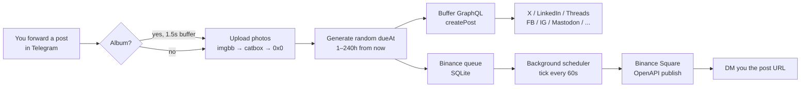

# Buffer Poster Bot

[](https://github.com/SMOService/buffer-poster-bot/actions/workflows/ci.yml)
[](LICENSE)
[](https://www.python.org/downloads/)
[](https://docs.aiogram.dev/)

> Self-hosted Telegram bot that turns forwarded messages into scheduled cross-posts across **Buffer** (X, LinkedIn, Threads, Facebook, Instagram, …) and **Binance Square** — with randomised scheduling so a single batch fills weeks of content.

[Русская версия](README.ru.md)

---

## What it does

Forward a Telegram post into the bot — it picks a random `dueAt` in the configured window (default 1–240 hours / up to 10 days) and schedules the post on every enabled Buffer channel + Binance Square. Drop 50 posts at once → you have ~10 days of content auto-pacing itself across all your socials.



### Example session

```
You ▸ [forward post: "GM ☀️ shipping a new feature today"]

Bot ▸ Buffer ⏰ 23 May 2026 14:30 UTC
        ✅ 🐦 @yourhandle
        ✅ 💼 LinkedIn — Your Company
        ✅ 🧵 Threads

      Binance Square ⏰ 23 May 2026 14:30 UTC
        📥 added to queue

      ────────
      "GM ☀️ shipping a new feature today"


You ▸ /queue

Bot ▸ Buffer queue:
        🐦 @yourhandle: 12 posts
        💼 LinkedIn:    11 posts
        🧵 Threads:     12 posts

      Binance Square: 12 posts
        next: 22 May 2026 09:15 UTC
```

### Features

- **Random scheduling** — every forwarded post gets a randomised `dueAt`. Configurable `SCHEDULE_MIN_HOURS` / `SCHEDULE_MAX_HOURS`.
- **Album / carousel support** — up to 4 photos grouped into a single Buffer post.
- **Duplicate guard** — MD5 hash of the post body, blocks re-posting the same text twice.
- **Channel toggle UI** — `/channels` with inline buttons; sync from Buffer with one tap.
- **Binance Square integration** — separate queue with per-post scheduler, `/binance` to inspect, manual *Send Now* override.
- **Image hosting fallback chain** — imgbb (primary) → catbox → 0x0.st. Buffer requires public image URLs, this handles it for you.
- **Single-user lock** — `ALLOWED_USER_ID` ensures only you can use your instance.
- **Zero infra** — SQLite on a mounted volume; deploys as a single worker process.

---

## Quick start

### 1. Get the tokens

| Variable | Where to find it |
|---|---|
| `TELEGRAM_BOT_TOKEN` | [@BotFather](https://t.me/BotFather) → `/newbot` |
| `ALLOWED_USER_ID`    | [@userinfobot](https://t.me/userinfobot) — your numeric Telegram ID |
| `BUFFER_ACCESS_TOKEN`| [publish.buffer.com/settings/api](https://publish.buffer.com/settings/api) → API (Beta) |
| `IMGBB_API_KEY`      | [api.imgbb.com](https://api.imgbb.com/) — free, recommended for reliable image hosting |
| `BINANCE_SQUARE_API_KEY` | Binance Square Creator Center (optional) |

### 2. Run with Docker

```bash
git clone https://github.com/SMOService/buffer-poster-bot.git
cd buffer-poster-bot
cp .env.example .env
# fill in .env
docker compose up -d
```

### 3. Or run locally

```bash
python -m venv .venv && source .venv/bin/activate
pip install -r requirements.txt
export TELEGRAM_BOT_TOKEN=...
export ALLOWED_USER_ID=...
export BUFFER_ACCESS_TOKEN=...
python bot.py
```

### 4. Or one-click on Railway

1. Fork this repo on GitHub.
2. Railway → **New Project** → **Deploy from GitHub** → pick your fork.
3. **Variables** tab → fill the five env vars above + `SCHEDULE_MIN_HOURS=1`, `SCHEDULE_MAX_HOURS=240`.
4. **Volume** (required, else data wipes on redeploy):
   - Right-click on canvas → **Volume** → service: `worker`, mount path: `/app/data`.
5. Railway auto-detects `Procfile` and starts the bot as a worker.

---

## Commands

| Command | What it does |
|---|---|
| `/start`    | Status: active channels, Binance queue size, next scheduled post |
| `/channels` | Toggle Buffer channels on/off; *Refresh from Buffer* to re-sync |
| `/queue`    | Scheduled-post counts per Buffer channel + Binance queue size |
| `/binance`  | Next 10 Binance Square posts with timestamps + manual *Send Now* |

**To post:** just forward (or send) a message to the bot. Supported: text, photo, photo + caption, album of up to 4 photos.

---

## How scheduling works

**Buffer.** On each forward the bot generates a random `dueAt` in the `[SCHEDULE_MIN_HOURS, SCHEDULE_MAX_HOURS]` window from *now* (default 1–240 h). The post is created via Buffer GraphQL with `mode: customScheduled` — Buffer publishes it at the scheduled time.

**Binance Square.** Posts are stored in a SQLite queue on the mounted volume. The background scheduler ticks every 60 s, finds posts whose `publish_at` has elapsed, calls the Binance Square OpenAPI, and notifies you in DM with a link to the published post.

**Duplicate protection.** Before scheduling, the bot computes `md5(text.strip().lower())` and checks the `published_hashes` table. Repeat? Hard block + warning to user.

**Albums.** Telegram delivers album items as separate messages with the same `media_group_id`. The bot buffers them for 1.5 s, then ships them all in one Buffer post (up to 4 images for X carousel compatibility).

---

## Architecture

```
buffer-poster-bot/
├── bot.py              # everything (745 LOC, single-file by design)
├── requirements.txt    # aiogram 3.x + aiohttp
├── Procfile            # Railway worker entrypoint
├── Dockerfile          # docker / docker-compose / Coolify / any VPS
├── docker-compose.yml  # ready-to-go with volume mount
├── .env.example        # all env vars documented
└── .github/
    ├── workflows/ci.yml          # ruff + py_compile + Docker build
    ├── ISSUE_TEMPLATE/           # bug / feature templates
    └── PULL_REQUEST_TEMPLATE.md
```

The bot is intentionally a single file. It's small enough to read in 20 minutes, fork, and modify for your stack — no abstractions to fight with.

### Database (SQLite, on `/app/data/bot.db`)

| Table | Purpose |
|---|---|
| `channels` | Buffer channel cache: `id`, `name`, `service`, `enabled` |
| `binance_queue` | Pending Binance Square posts: `text`, `image_url`, `publish_at`, `published` |
| `published_hashes` | MD5 of every successfully scheduled post body (dedup guard) |

---

## Configuration reference

See [`.env.example`](.env.example) for the full annotated list. Required:

```env
TELEGRAM_BOT_TOKEN=123456789:AA...
ALLOWED_USER_ID=123456789
BUFFER_ACCESS_TOKEN=1/abc...
```

Optional:

```env
IMGBB_API_KEY=...                # recommended — primary image host
BINANCE_SQUARE_API_KEY=...       # enables Binance Square publishing
SCHEDULE_MIN_HOURS=1             # default 1 (one hour)
SCHEDULE_MAX_HOURS=240           # default 240 (ten days)
DB_PATH=/app/data/bot.db         # override only for local dev
```

---

## Adding a new social network

1. Connect the channel in Buffer: **Settings → Channels → Connect Channel**.
2. In the bot: `/channels` → tap **🔄 Refresh from Buffer**.
3. The new channel appears in the list — tap it to enable.

Anything Buffer supports (currently 9+ networks) just works. No code changes needed.

---

## Ecosystem

Part of the **SMOService** posting toolchain:

- **[Cross-Post-Bridge-AI-bot](https://github.com/SMOService/Cross-Post-Bridge-AI-bot)** — bridges between your Telegram channels with AI rewriting, translation, and cross-posting.

If you want the **commercial multi-tenant** version (multiple projects, Stars billing, Mini App, Buffer + Upload-Post + Postmypost) — it's in development. Watch this org.

---

## Contributing

PRs welcome — see [CONTRIBUTING.md](CONTRIBUTING.md). Bug reports via the [issue templates](https://github.com/SMOService/buffer-poster-bot/issues/new/choose). Security disclosures: [SECURITY.md](SECURITY.md).

---

## License

[MIT](LICENSE) © 2026 SMOService

## Acknowledgements

- [aiogram 3.x](https://docs.aiogram.dev/) — Telegram Bot framework
- [aiohttp](https://docs.aiohttp.org/) — async HTTP client
- [Buffer GraphQL API](https://developers.buffer.com) — the scheduling backbone
- [Binance Square OpenAPI](https://www.binance.com/en/skills/detail/binance/square-post) — Web3 distribution
- imgbb, catbox.moe, 0x0.st — free image hosts that make Buffer's URL-only assets workable
