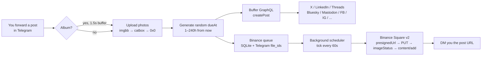

# Buffer Poster Bot

[](https://github.com/SMOService/buffer-poster-bot/actions/workflows/ci.yml)
[](LICENSE)
[](https://www.python.org/downloads/)
[](https://docs.aiogram.dev/)

> Self-hosted Telegram bot that turns forwarded messages into scheduled cross-posts across **Buffer** (X, LinkedIn, Threads, Bluesky, Mastodon, Facebook, Instagram, …) and **Binance Square** — with randomised scheduling so a single batch fills weeks of content. Inline menu, full CRUD over the queue, publication journal.

[Русская версия](README.ru.md)

---

## What's new in v2.0

- 🪙 **Binance Square media flow** — the bot now uploads images to Binance Square via the official v2 OpenAPI (`presignedUrl` → `PUT` → `imageStatus` polling → `content/add` with `imageList`). Up to 4 photos per post, articles with a cover image supported in the SDK layer. Previously the bot dropped images on Binance and posted text only.
- 🧭 **Inline main menu** — `/start` opens a menu (`📡 Channels / 📋 Queue / 🪙 Binance / 📊 Logs / ⚙️ Settings`); every screen has a `← Main menu` button. The plain slash commands still work as shortcuts.
- 📊 **`/logs` journal** — paginated history of every Buffer and Binance publish attempt, with a "failures only" filter. Rotates by `HISTORY_LIMIT` (default 500).
- ✏️ **Binance queue CRUD** — for each pending post: `📤 Send now / ✏️ Edit text / 🔁 Reschedule / 🗑 Delete` with confirm dialogs.
- ⏸ **Pause / resume scheduler** + **⚡ Publish all now** (batch flush, with confirmation).
- 🧩 **Modular architecture** — the old single-file `bot.py` (745 LOC) is split into `config.py / db.py / bot_instance.py / scheduler.py / state.py / keyboards.py + services/{buffer,binance,uploader}.py + handlers/{menu,channels,queue,binance,logs,post}.py`. Easier to navigate, extend, and contribute to.
- 🗃 **Schema migrations** via `PRAGMA user_version`. Backward-compatible with v1.x databases.

See [`CHANGELOG.md`](CHANGELOG.md) for the full diff vs v1.3.1.

---

## What it does

Forward a Telegram post into the bot — it picks a random `dueAt` in the configured window (default 1–240 hours / up to 10 days) and schedules the post on every enabled Buffer channel + Binance Square. Drop 50 posts at once → you have ~10 days of content auto-pacing itself across all your socials.



### Example session

```
You ▸ [forward post: "GM ☀️ shipping a new feature today"]

Bot ▸ Buffer ⏰ 23 May 2026 14:30 UTC
        ✅ 🐦 @yourhandle
        ✅ 💼 LinkedIn — Your Company
        ✅ 🧵 Threads
        ✅ 🦋 Bluesky

      Binance Square ⏰ 23 May 2026 14:30 UTC
        📥 queued #42 (1 photo)

      ────────
      🖼 photo: 1
      "GM ☀️ shipping a new feature today"


You ▸ /menu

Bot ▸ 👋 Buffer Poster Bot

      Active Buffer channels (4):
        🐦 @yourhandle
        💼 LinkedIn — Your Company
        🧵 Threads
        🦋 Bluesky

      Binance Square: ✅ active
        in queue: 12 posts
        next: 24 May 2026 09:15 UTC

      Schedule: random 1–240 h
      📊 history: 47 ✅ / 2 ❌ (total 49)

      [📡 Channels] [📋 Queue]
      [🪙 Binance Square] [📊 Logs]
      [⚙️ Settings] [🔁 Refresh]
```

### Features

- **Random scheduling** — every forwarded post gets a randomised `dueAt`. Configurable via `SCHEDULE_MIN_HOURS` / `SCHEDULE_MAX_HOURS`.
- **Album / carousel support** — up to 4 photos grouped into one Buffer post and one Binance Square image post.
- **Duplicate guard** — MD5 hash of the post body, blocks re-posting the same text twice.
- **Inline menu + CRUD** — main menu, channel toggles, queue management (edit / delete / reschedule / send now).
- **Publication journal** — `/logs` with success + failure history, paginated, filterable.
- **Binance Square v2 media flow** — official implementation per [binance/binance-skills-hub](https://github.com/binance/binance-skills-hub) (image upload, polling status, error code recognition for `220003/220004/220009/220014/20002/20013/20022`).
- **Image hosting fallback chain** for Buffer — imgbb (primary) → catbox → 0x0.st.
- **Single-user lock** — `ALLOWED_USER_ID` ensures only you can use your instance.
- **Pause / resume** the Binance scheduler at any time + **batch flush** to publish everything in the queue immediately.
- **Zero infra** — SQLite on a mounted volume; deploys as a single worker process.

---

## Quick start

### 1. Get the tokens

| Variable | Where to find it |
|---|---|
| `TELEGRAM_BOT_TOKEN` | [@BotFather](https://t.me/BotFather) → `/newbot` |
| `ALLOWED_USER_ID`    | [@userinfobot](https://t.me/userinfobot) — your numeric Telegram ID |
| `BUFFER_ACCESS_TOKEN`| [publish.buffer.com/settings/api](https://publish.buffer.com/settings/api) → API (Beta) |
| `IMGBB_API_KEY`      | [api.imgbb.com](https://api.imgbb.com/) — free, recommended for reliable image hosting on Buffer |
| `BINANCE_SQUARE_API_KEY` | [Binance Skills Hub → square-post → Creator Center](https://www.binance.com/en/skills/detail/binance/square-post) (optional) |

### 2. Run with Docker

```bash
git clone https://github.com/SMOService/buffer-poster-bot.git
cd buffer-poster-bot
cp .env.example .env
# fill in .env
docker compose up -d
```

### 3. Or run locally

```bash
python -m venv .venv && source .venv/bin/activate
pip install -r requirements.txt
export TELEGRAM_BOT_TOKEN=...
export ALLOWED_USER_ID=...
export BUFFER_ACCESS_TOKEN=...
python bot.py
```

### 4. Or one-click on Railway

1. Fork this repo on GitHub.
2. Railway → **New Project** → **Deploy from GitHub** → pick your fork.
3. **Variables** tab → fill the env vars above + `SCHEDULE_MIN_HOURS=1`, `SCHEDULE_MAX_HOURS=240`.
4. **Volume** (required, else data wipes on redeploy):
   - Right-click on canvas → **Volume** → service: `worker`, mount path: `/app/data`.
5. Railway auto-detects `Procfile` and starts the bot as a worker.

---

## Commands

| Command | What it does |
|---|---|
| `/start` or `/menu` | Main menu with inline buttons |
| `/channels` | Toggle Buffer channels on/off; *Refresh from Buffer* to re-sync |
| `/queue`    | Scheduled-post counts per Buffer channel + Binance summary |
| `/binance`  | Binance Square queue with full CRUD on each post |
| `/logs`     | Paginated journal of publish attempts (success + failures) |

**To post:** just forward (or send) a message to the bot. Supported: text, photo, photo + caption, album of up to 4 photos.

---

## How scheduling works

**Buffer.** On each forward the bot generates a random `dueAt` in the `[SCHEDULE_MIN_HOURS, SCHEDULE_MAX_HOURS]` window from *now* (default 1–240 h). The post is created via Buffer GraphQL with `mode: customScheduled` — Buffer publishes it at the scheduled time.

**Binance Square.** Posts are stored in a SQLite queue on the mounted volume **along with Telegram `file_id`s** for any attached photos. The background scheduler ticks every 60 s, finds posts whose `publish_at` has elapsed, downloads fresh bytes from Telegram, runs them through the official Binance v2 media flow, and DMs you with a link to the published post.

**Duplicate protection.** Before scheduling, the bot computes `md5(text.strip().lower())` and checks the `published_hashes` table. Repeat? Hard block + warning to user.

**Albums.** Telegram delivers album items as separate messages with the same `media_group_id`. The bot buffers them for 1.5 s, then ships them all in one Buffer post + one Binance Square image post (up to 4 images for X carousel compatibility).

**Pause / batch.** Need to freeze posting before a launch? Tap `⏸ Pause` on the Binance screen. Want to flush the queue immediately (e.g. for a coordinated drop)? `⚡ Publish all now` with a confirm.

---

## Binance Square v2 media flow

Implementation follows [binance/binance-skills-hub](https://github.com/binance/binance-skills-hub) (`post-image.mjs`, `post-video.mjs`, `lib.mjs`). There is no separate OpenAPI doc on `developers.binance.com` — the skill source is the canonical reference.

| Step | URL | Body |
|---|---|---|
| 1. Presign | `POST /bapi/composite/v2/public/pgc/openApi/image/presignedUrl` | `{"imageName":"<name>.<ext>"}` → `data.presignedUrl`, `data.fileTicket` |
| 2. Upload | `PUT <presignedUrl>` | raw bytes, `Content-Type: image/<ext>` (jpg/png/gif/webp) |
| 3. Status | `POST /bapi/composite/v2/public/pgc/openApi/image/imageStatus` | `{"fileTicket":...}` polling 3s × 10 → `data.imageUrl` when `status==1` |
| 4. Publish | `POST /bapi/composite/v1/public/pgc/openApi/content/add` | `{"contentType":1, "bodyTextOnly":"...", "imageList":[imageUrl, ...]}` (up to 4) |

All JSON requests carry `X-Square-OpenAPI-Key`, `Content-Type: application/json`, **`clienttype: binanceSkill`**.

Quirks handled by `services/binance.py`:
- HTTP 504 on `/content/add` is treated as success without a `post_id` (per official helper).
- Known error codes (`220003/4/9/14`, `20002/13/22`) are mapped to human-readable journal entries.
- Daily limits: **100 posts/day**, **400 uploads/day** — exceeded → `220009/220014` flagged in `/logs`.

Article-mode (`contentType=2` with a cover image) and video-mode (`contentType=3`) are implemented in the SDK layer (`publish_article`, `publish_video` helpers) but not surfaced in the UI yet — see "Roadmap" below.

---

## Architecture

```
buffer-poster-bot/
├── bot.py              # entry point: init_db, load channels, start scheduler, polling
├── bot_instance.py     # aiogram Bot/Dispatcher singletons + download_telegram_file
├── config.py           # env + constants (BUFFER_API, BINANCE_API_V1/V2, …)
├── db.py               # sqlite + migrations via PRAGMA user_version (schema v3)
├── keyboards.py        # every InlineKeyboardMarkup builder
├── scheduler.py        # background Binance publisher (60s tick, pause-aware)
├── state.py            # FSM states (EditBinance.waiting_text)
├── services/
│   ├── buffer.py       # Buffer GraphQL: fetch_channels, create_post, count_scheduled_posts
│   ├── binance.py      # v1 text + v2 media flow (presignedUrl → PUT → imageStatus → content/add)
│   └── uploader.py     # imgbb (primary) / catbox / 0x0.st fallback chain for Buffer
├── handlers/
│   ├── menu.py         # /start, /menu, home / settings callbacks
│   ├── channels.py     # /channels + toggle + refresh
│   ├── queue.py        # /queue summary
│   ├── binance.py      # /binance + CRUD + pause/resume + flush
│   ├── logs.py         # /logs + pagination + filter
│   ├── post.py         # handle_post (forward → Buffer + Binance queue)
│   └── common.py       # is_me, fmt_ts, fmt_delta, preview, random_due_at
├── Procfile            # Railway worker entrypoint
├── Dockerfile          # docker / docker-compose / Coolify / any VPS
├── docker-compose.yml  # ready-to-go with volume mount
├── .env.example        # all env vars documented
├── pyproject.toml      # ruff config
└── .github/
    ├── workflows/ci.yml          # ruff + py_compile + import smoke + Docker build
    ├── ISSUE_TEMPLATE/           # bug / feature templates
    └── PULL_REQUEST_TEMPLATE.md
```

### Database (SQLite, on `/app/data/bot.db`, schema v3)

| Table | Purpose |
|---|---|
| `channels` | Buffer channel cache: `id`, `name`, `service`, `enabled` |
| `binance_queue` | Pending posts: `text`, `image_urls` (JSON, imgbb), `image_file_ids` (JSON, Telegram), `content_type`, `title`, `publish_at`, `published`, `last_error`, `attempt_count` |
| `published_hashes` | MD5 of every successfully scheduled post body (dedup guard) |
| `post_history` | Journal: `kind` (buffer/binance), `service`, `status`, `text_preview`, `ext_id`, `ext_url`, `error` (rotates by `HISTORY_LIMIT`) |
| `kv` | Key-value store for scheduler state (`binance_paused` etc.) |

Migrations run incrementally on startup via `PRAGMA user_version` — upgrading from v1.x preserves your data.

---

## Configuration reference

See [`.env.example`](.env.example) for the full annotated list. Required:

```env
TELEGRAM_BOT_TOKEN=123456789:AA...
ALLOWED_USER_ID=123456789
BUFFER_ACCESS_TOKEN=1/abc...
```

Optional:

```env
IMGBB_API_KEY=...                # recommended — primary image host for Buffer
BINANCE_SQUARE_API_KEY=...       # enables Binance Square publishing
BINANCE_USE_IMAGES=1             # 1 = upload to Binance v2, 0 = text-only Binance posts
SCHEDULE_MIN_HOURS=1             # default 1 (one hour)
SCHEDULE_MAX_HOURS=240           # default 240 (ten days)
HISTORY_LIMIT=500                # post_history rotation size
DB_PATH=/app/data/bot.db         # override only for local dev
```

---

## Adding a new social network

1. Connect the channel in Buffer: **Settings → Channels → Connect Channel**.
2. In the bot: `/channels` → tap **🔄 Refresh from Buffer**.
3. The new channel appears in the list — tap it to enable.

Anything Buffer supports (currently 9+ networks) just works. No code changes needed.

---

## Roadmap

- 📰 **Article publishing UI** — surface `contentType=2` (long-form with cover image) in the forward flow. The SDK helper `publish_article(title, body, cover)` exists; needs a `/article` command or a forward-prompt.
- 🎬 **Video posts** — `contentType=3` is reserved in `services/binance.py`. Needs Telegram `message.video` handler + `video_file_id` queue column.
- 🧪 **Tests** — offline smoke harness exists on the maintainer's disk, will be added to `tests/` in a follow-up.
- 🪝 **Webhook mode** — currently polling-only; webhook mode would simplify zero-downtime deploys.
- 🧹 **Auto-cleanup** — `binance_queue.published=1` rows live forever today; needs a TTL (e.g. 30 days).

---

## Ecosystem

Part of the **SMOService** posting toolchain:

- **[Cross-Post-Bridge-AI-bot](https://github.com/SMOService/Cross-Post-Bridge-AI-bot)** — bridges between your Telegram channels with AI rewriting, translation, and cross-posting.

If you want the **commercial multi-tenant** version (multiple projects, Stars billing, Mini App, Buffer + Upload-Post + Postmypost) — it's in development. Watch this org.

---

## Contributing

PRs welcome — see [CONTRIBUTING.md](CONTRIBUTING.md). Bug reports via the [issue templates](https://github.com/SMOService/buffer-poster-bot/issues/new/choose). Security disclosures: [SECURITY.md](SECURITY.md).

---

## License

[MIT](LICENSE) © 2026 SMOService

## Acknowledgements

- [aiogram 3.x](https://docs.aiogram.dev/) — Telegram Bot framework
- [aiohttp](https://docs.aiohttp.org/) — async HTTP client
- [Buffer GraphQL API](https://developers.buffer.com) — the scheduling backbone
- [Binance Skills Hub: square-post](https://github.com/binance/binance-skills-hub) — official reference for Binance Square OpenAPI
- imgbb, catbox.moe, 0x0.st — free image hosts that make Buffer's URL-only assets workable
