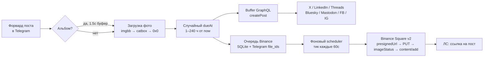

# Buffer Poster Bot

[](https://github.com/SMOService/buffer-poster-bot/actions/workflows/ci.yml)
[](LICENSE)
[](https://www.python.org/downloads/)
[](https://docs.aiogram.dev/)

> Self-hosted Telegram-бот: пересылаешь пост — он планирует публикацию со случайным временем (1–240 ч) на всех каналах **Buffer** (X, LinkedIn, Threads, Bluesky, Mastodon, Facebook, Instagram, …) и в **Binance Square**. Закинул 50 постов = месяц контента вперёд. Inline-меню, полный CRUD над очередью, журнал публикаций.

[English version](README.md)

---

## Что нового в v2.0

- 🪙 **Binance Square media flow** — бот теперь грузит картинки в Binance Square через официальный v2 OpenAPI (`presignedUrl` → `PUT` → `imageStatus` polling → `content/add` с `imageList`). До 4 фото на пост, поддержка статей с обложкой в SDK-слое. Раньше картинки в Binance игнорировались — публиковался только текст.
- 🧭 **Inline главное меню** — `/start` открывает меню (`📡 Каналы / 📋 Очередь / 🪙 Binance / 📊 Логи / ⚙️ Настройки`), на каждом подэкране есть кнопка `← Главное меню`. Старые слэш-команды оставлены как shortcuts.
- 📊 **Журнал `/logs`** — пагинированная история публикаций (Buffer + Binance, success + failed) с фильтром «только фейлы». Ротация по `HISTORY_LIMIT` (default 500).
- ✏️ **CRUD очереди Binance** — на каждом посте: `📤 Отправить сейчас / ✏️ Изменить текст / 🔁 Перепланировать / 🗑 Удалить` с confirm-диалогами.
- ⏸ **Pause / Resume scheduler** + **⚡ Опубликовать всё сейчас** (batch flush с подтверждением).
- 🧩 **Модульная архитектура** — старый монолит `bot.py` (745 строк) распилен на `config.py / db.py / bot_instance.py / scheduler.py / state.py / keyboards.py + services/{buffer,binance,uploader}.py + handlers/{menu,channels,queue,binance,logs,post}.py`. Проще навигироваться, расширять и контрибьютить.
- 🗃 **Миграции БД** через `PRAGMA user_version`. Совместимо со старыми bot.db от v1.x.

Полный diff vs v1.3.1 — в [`CHANGELOG.md`](CHANGELOG.md).

---

## Что делает

Пересылаешь пост в бота — бот выбирает случайный `dueAt` в окне `1–240 ч` и планирует публикацию на всех включённых каналах Buffer + Binance Square. Один drop из 50 постов = ~месяц контента вперёд.



### Пример сессии

```
Ты ▸ [форвард поста: «GM ☀️ сегодня катим новую фичу»]

Бот ▸ Buffer ⏰ 23 May 2026 14:30 UTC
        ✅ 🐦 @yourhandle
        ✅ 💼 LinkedIn — Your Company
        ✅ 🧵 Threads
        ✅ 🦋 Bluesky

      Binance Square ⏰ 23 May 2026 14:30 UTC
        📥 в очереди #42 (1 фото)

      ────────
      🖼 фото: 1
      «GM ☀️ сегодня катим новую фичу»


Ты ▸ /menu

Бот ▸ 👋 Buffer Poster Bot

      Активных каналов Buffer (4):
        🐦 @yourhandle
        💼 LinkedIn — Your Company
        🧵 Threads
        🦋 Bluesky

      Binance Square: ✅ активен
        в очереди: 12 постов
        следующий: 24 May 2026 09:15 UTC

      Расписание: случайно 1–240 ч
      📊 история: 47 ✅ / 2 ❌ (всего 49)

      [📡 Каналы] [📋 Очередь]
      [🪙 Binance Square] [📊 Логи]
      [⚙️ Настройки] [🔁 Обновить]
```

### Фичи

- **Случайное расписание** — каждый пост получает случайный `dueAt`. Настраивается через `SCHEDULE_MIN_HOURS` / `SCHEDULE_MAX_HOURS`.
- **Альбомы / карусели** — до 4 фото группируются в один Buffer-пост и один Binance Square image post.
- **Защита от дублей** — MD5 хэш текста, блокирует повторные публикации.
- **Inline-меню + CRUD** — главное меню, переключение каналов, управление очередью (edit/delete/reschedule/send now).
- **Журнал публикаций** — `/logs` с историей успехов и фейлов, пагинацией, фильтром.
- **Binance Square v2 media flow** — официальная реализация из [binance/binance-skills-hub](https://github.com/binance/binance-skills-hub) (image upload, polling status, error codes `220003/220004/220009/220014/20002/20013/20022`).
- **Image hosting fallback chain** для Buffer — imgbb (primary) → catbox → 0x0.st.
- **Single-user lock** — `ALLOWED_USER_ID` гарантирует что инстансом пользуешься только ты.
- **Pause / resume** Binance scheduler + **batch flush** «опубликовать всё сейчас».
- **Zero infra** — SQLite на mounted volume, один worker процесс.

---

## Quick start

### 1. Получи токены

| Переменная | Где взять |
|---|---|
| `TELEGRAM_BOT_TOKEN` | [@BotFather](https://t.me/BotFather) → `/newbot` |
| `ALLOWED_USER_ID`    | [@userinfobot](https://t.me/userinfobot) — твой numeric Telegram ID |
| `BUFFER_ACCESS_TOKEN`| [publish.buffer.com/settings/api](https://publish.buffer.com/settings/api) → API (Beta) |
| `IMGBB_API_KEY`      | [api.imgbb.com](https://api.imgbb.com/) — бесплатный, рекомендую для надёжности |
| `BINANCE_SQUARE_API_KEY` | [Binance Skills Hub → square-post → Creator Center](https://www.binance.com/en/skills/detail/binance/square-post) (опционально) |

### 2. Запуск через Docker

```bash
git clone https://github.com/SMOService/buffer-poster-bot.git
cd buffer-poster-bot
cp .env.example .env
# заполни .env
docker compose up -d
```

### 3. Или локально

```bash
python -m venv .venv && source .venv/bin/activate
pip install -r requirements.txt
export TELEGRAM_BOT_TOKEN=...
export ALLOWED_USER_ID=...
export BUFFER_ACCESS_TOKEN=...
python bot.py
```

### 4. Или one-click на Railway

1. Сделай fork репо на GitHub.
2. Railway → **New Project** → **Deploy from GitHub** → выбери свой fork.
3. **Variables** → заполни env-переменные сверху + `SCHEDULE_MIN_HOURS=1`, `SCHEDULE_MAX_HOURS=240`.
4. **Volume** (обязательно, иначе данные сотрутся при redeploy):
   - Правая кнопка на canvas → **Volume** → service: `worker`, mount path: `/app/data`.
5. Railway подхватит `Procfile` и запустит как worker.

---

## Команды

| Команда | Что делает |
|---|---|
| `/start` или `/menu` | Главное меню с inline-кнопками |
| `/channels` | Включить/выключить каналы Buffer; *Обновить из Buffer* для пересинхронизации |
| `/queue`    | Счётчики постов в очередях Buffer + сводка Binance |
| `/binance`  | Очередь Binance Square с CRUD на каждом посте |
| `/logs`     | Пагинированный журнал публикаций |

**Чтобы опубликовать:** просто перешли (или отправь) сообщение в бота. Поддерживается: текст, фото, фото + подпись, альбом до 4 фото.

---

## Как работает расписание

**Buffer.** При каждой пересылке бот генерирует случайный `dueAt` в окне `[SCHEDULE_MIN_HOURS, SCHEDULE_MAX_HOURS]` от *now* (default 1–240 ч). Пост создаётся через Buffer GraphQL с `mode: customScheduled`.

**Binance Square.** Посты хранятся в SQLite-очереди на mounted volume **вместе с Telegram `file_id`s** на прикреплённые фото. Фоновый scheduler тикает каждые 60 с, забирает посты с истёкшим `publish_at`, скачивает свежие байты из Telegram, прогоняет через официальный Binance v2 media flow, и шлёт тебе ссылку на опубликованный пост.

**Защита от дублей.** Перед планированием бот считает `md5(text.strip().lower())` и проверяет таблицу `published_hashes`. Повтор? Жёсткий блок + предупреждение.

**Альбомы.** Telegram доставляет элементы альбома как отдельные сообщения с общим `media_group_id`. Бот буферизует их 1.5 с и шлёт одним Buffer-постом + одним Binance Square image post (до 4 фото для совместимости с X carousel).

**Pause / batch.** Нужно заморозить публикации перед лончем? Тапни `⏸ Pause` на экране Binance. Хочешь слить очередь сразу (например для координированного дропа)? `⚡ Опубликовать всё сейчас` с подтверждением.

---

## Binance Square v2 media flow

Реализация повторяет [binance/binance-skills-hub](https://github.com/binance/binance-skills-hub) (`post-image.mjs`, `post-video.mjs`, `lib.mjs`). Отдельной OpenAPI-страницы на `developers.binance.com` Binance не выпустил — исходники skill'а = единственный канонический источник.

| Шаг | URL | Body |
|---|---|---|
| 1. Presign | `POST /bapi/composite/v2/public/pgc/openApi/image/presignedUrl` | `{"imageName":"<name>.<ext>"}` → `data.presignedUrl`, `data.fileTicket` |
| 2. Upload | `PUT <presignedUrl>` | raw bytes, `Content-Type: image/<ext>` (jpg/png/gif/webp) |
| 3. Status | `POST /bapi/composite/v2/public/pgc/openApi/image/imageStatus` | `{"fileTicket":...}` polling 3с × 10 → `data.imageUrl` когда `status==1` |
| 4. Publish | `POST /bapi/composite/v1/public/pgc/openApi/content/add` | `{"contentType":1, "bodyTextOnly":"...", "imageList":[imageUrl, ...]}` (до 4) |

Все JSON-запросы идут с `X-Square-OpenAPI-Key`, `Content-Type: application/json`, **`clienttype: binanceSkill`**.

Quirks, которые обрабатывает `services/binance.py`:
- HTTP 504 на `/content/add` трактуется как success без `post_id` (как в официальном helper).
- Известные коды ошибок (`220003/4/9/14`, `20002/13/22`) переводятся в человекочитаемые записи в журнале.
- Daily limits: **100 постов/день**, **400 uploads/день** — превышение → `220009/220014` в `/logs`.

Article-mode (`contentType=2` со cover) и video-mode (`contentType=3`) — есть в SDK-слое (`publish_article`, `publish_video`), но UI ещё не сделан, см. Roadmap.

---

## Архитектура

```
buffer-poster-bot/
├── bot.py              # entry point: init_db, загрузка каналов, start scheduler, polling
├── bot_instance.py     # aiogram Bot/Dispatcher singletons + download_telegram_file
├── config.py           # env + constants (BUFFER_API, BINANCE_API_V1/V2, …)
├── db.py               # sqlite + миграции через PRAGMA user_version (schema v3)
├── keyboards.py        # все builders InlineKeyboardMarkup
├── scheduler.py        # background Binance publisher (60s тик, pause-aware)
├── state.py            # FSM states (EditBinance.waiting_text)
├── services/
│   ├── buffer.py       # Buffer GraphQL: fetch_channels, create_post, count_scheduled_posts
│   ├── binance.py      # v1 text + v2 media flow (presignedUrl → PUT → imageStatus → content/add)
│   └── uploader.py     # imgbb (primary) / catbox / 0x0.st fallback chain для Buffer
├── handlers/
│   ├── menu.py         # /start, /menu, home / settings callbacks
│   ├── channels.py     # /channels + toggle + refresh
│   ├── queue.py        # /queue summary
│   ├── binance.py      # /binance + CRUD + pause/resume + flush
│   ├── logs.py         # /logs + пагинация + фильтр
│   ├── post.py         # handle_post (forward → Buffer + Binance queue)
│   └── common.py       # is_me, fmt_ts, fmt_delta, preview, random_due_at
├── Procfile            # Railway worker entrypoint
├── Dockerfile          # docker / docker-compose / Coolify / любой VPS
├── docker-compose.yml  # готовый с volume mount
├── .env.example        # все env vars документированы
├── pyproject.toml      # ruff config
└── .github/
    ├── workflows/ci.yml          # ruff + py_compile + import smoke + Docker build
    ├── ISSUE_TEMPLATE/           # шаблоны bug / feature
    └── PULL_REQUEST_TEMPLATE.md
```

### БД (SQLite, `/app/data/bot.db`, schema v3)

| Таблица | Назначение |
|---|---|
| `channels` | Кэш каналов Buffer: `id`, `name`, `service`, `enabled` |
| `binance_queue` | Pending посты: `text`, `image_urls` (JSON, imgbb), `image_file_ids` (JSON, Telegram), `content_type`, `title`, `publish_at`, `published`, `last_error`, `attempt_count` |
| `published_hashes` | MD5 каждого опубликованного поста (dedup) |
| `post_history` | Журнал: `kind` (buffer/binance), `service`, `status`, `text_preview`, `ext_id`, `ext_url`, `error` (ротация по `HISTORY_LIMIT`) |
| `kv` | Key-value хранилище для состояния scheduler'а (`binance_paused` etc.) |

Миграции выполняются инкрементально на старте через `PRAGMA user_version` — апгрейд с v1.x сохраняет данные.

---

## Configuration reference

См. [`.env.example`](.env.example) для полного аннотированного списка. Обязательные:

```env
TELEGRAM_BOT_TOKEN=123456789:AA...
ALLOWED_USER_ID=123456789
BUFFER_ACCESS_TOKEN=1/abc...
```

Опциональные:

```env
IMGBB_API_KEY=...                # рекомендую — primary image host для Buffer
BINANCE_SQUARE_API_KEY=...       # включает Binance Square
BINANCE_USE_IMAGES=1             # 1 = грузить в Binance v2, 0 = text-only посты в Binance
SCHEDULE_MIN_HOURS=1             # default 1
SCHEDULE_MAX_HOURS=240           # default 240 (10 дней)
HISTORY_LIMIT=500                # ротация post_history
DB_PATH=/app/data/bot.db         # override только для local dev
```

---

## Добавить новую соцсеть

1. Подключи канал в Buffer: **Settings → Channels → Connect Channel**.
2. В боте: `/channels` → тапни **🔄 Обновить из Buffer**.
3. Новый канал появится в списке — тапни чтобы включить.

Всё что поддерживает Buffer (сейчас 9+ сетей) работает из коробки. Код менять не нужно.

---

## Roadmap

- 📰 **Article publishing UI** — surface `contentType=2` (long-form со cover) в forward-flow. SDK-хелпер `publish_article(title, body, cover)` уже есть; нужна команда `/article` или forward-prompt.
- 🎬 **Video posts** — `contentType=3` зарезервирован в `services/binance.py`. Нужен `message.video` handler + колонка `video_file_id` в очереди.
- 🧪 **Tests** — offline smoke harness существует на диске maintainer'а, переедет в `tests/` в следующем релизе.
- 🪝 **Webhook mode** — сейчас только polling; webhook упростит zero-downtime деплои.
- 🧹 **Auto-cleanup** — `binance_queue.published=1` строки сейчас живут вечно; нужен TTL (например 30 дней).

---

## Экосистема

Часть **SMOService** posting toolchain:

- **[Cross-Post-Bridge-AI-bot](https://github.com/SMOService/Cross-Post-Bridge-AI-bot)** — мосты между твоими Telegram-каналами с AI-rewriting, переводом и cross-posting'ом.

Если хочется **коммерческой multi-tenant** версии (несколько проектов, Stars billing, Mini App, Buffer + Upload-Post + Postmypost) — она в разработке. Следи за этой org.

---

## Contributing

PR welcome — см. [CONTRIBUTING.md](CONTRIBUTING.md). Bug reports через [issue-шаблоны](https://github.com/SMOService/buffer-poster-bot/issues/new/choose). Security disclosures: [SECURITY.md](SECURITY.md).

---

## License

[MIT](LICENSE) © 2026 SMOService

## Acknowledgements

- [aiogram 3.x](https://docs.aiogram.dev/) — Telegram Bot framework
- [aiohttp](https://docs.aiohttp.org/) — async HTTP client
- [Buffer GraphQL API](https://developers.buffer.com) — scheduling backbone
- [Binance Skills Hub: square-post](https://github.com/binance/binance-skills-hub) — официальный reference для Binance Square OpenAPI
- imgbb, catbox.moe, 0x0.st — бесплатные image-хосты, без которых Buffer URL-only assets неудобны
